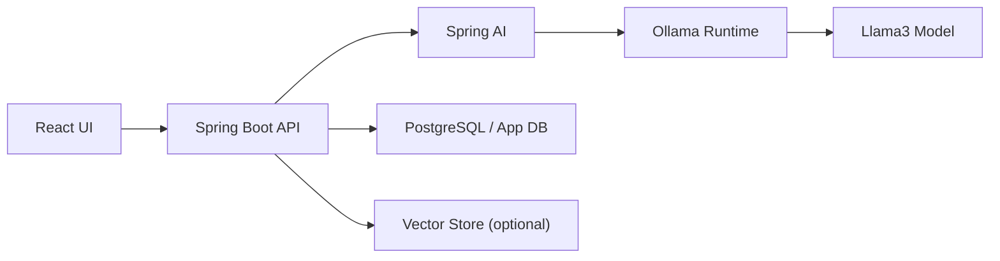

# Spring AI + Local LLM (Ollama + Llama3) Developer Notes

These are practical engineering notes for building AI-backed backend services using Spring Boot + Spring AI with a local model runtime (Ollama, model: `llama3`).

## 1. Introduction to AI-powered Applications

### What LLMs are
- LLM (Large Language Model) is a neural network trained on massive text corpora to predict the next token.
- In practice, this enables tasks like summarization, Q&A, extraction, classification, and code generation.
- LLMs are probabilistic: same prompt can return different outputs depending on decoding settings.

### How AI apps differ from traditional backend apps
- Traditional backend logic is deterministic: same input, same output.
- AI logic is probabilistic and prompt-driven: same input may produce variation.
- Quality depends on:
  - Prompt design
  - Context provided
  - Model capability
  - Runtime settings (temperature, max tokens)
- Testing moves from strict equality to behavior and quality thresholds.

### Typical architecture of an AI application
- Client app sends intent + context.
- Backend applies rules, security, prompt templates.
- AI layer calls model.
- Optional retrieval layer injects enterprise knowledge.
- Observability layer tracks latency, token usage, and quality.

### Example architecture: React → Spring Boot → Spring AI → Ollama (Llama3)


---

## 2. Core AI Concepts (Framework Agnostic)

### Prompt Engineering
- Definition: Crafting instructions/context so model returns desired output.
- Why it matters: Prompt quality often dominates output quality.
- Real-world example: For invoice extraction, ask for strict JSON schema with required fields.

### Tokens
- Definition: Small text units model reads/writes; billing and limits are token-based.
- Why it matters: More tokens increase latency and cost; hard context limits apply.
- Real-world example: Large chat history can exceed model limits, causing truncation.

### Temperature
- Definition: Randomness control in token sampling.
- Why it matters: Low values increase consistency; high values increase creativity.
- Real-world example: Set low (0.1-0.3) for support answers, higher (0.7+) for brainstorming.

### Context Window
- Definition: Max tokens model can process in one request (input + output).
- Why it matters: Exceeding limit drops context or fails request.
- Real-world example: Use summarization of prior chat turns before appending new user messages.

### Embeddings
- Definition: Vector representation of text meaning.
- Why it matters: Enables semantic search beyond keyword matching.
- Real-world example: Query "refund policy" can retrieve docs saying "returns within 30 days".

### Vector Databases
- Definition: Databases optimized for nearest-neighbor search over embeddings.
- Why it matters: Core storage/retrieval layer for RAG systems.
- Real-world example: Store product docs embeddings in pgvector, Pinecone, Qdrant, or Milvus.

### Retrieval Augmented Generation (RAG)
- Definition: Retrieve relevant docs and inject them into prompt before generation.
- Why it matters: Grounds responses in your data and reduces hallucinations.
- Real-world example: Internal support bot answers from current policy docs, not model memory.

### Tool Calling / Function Calling
- Definition: Model requests execution of backend functions/tools.
- Why it matters: Lets LLM trigger deterministic actions (DB lookup, API call, workflow step).
- Real-world example: "Book meeting" triggers calendar API function, then model summarizes result.

### System Prompt vs User Prompt
- Definition:
  - System prompt: Global behavior/rules/persona.
  - User prompt: Per-request instruction.
- Why it matters: Strong system instructions enforce consistency and safety.
- Real-world example: System says "Never return SQL without LIMIT"; user asks analytics question.

### Hallucinations
- Definition: Fluent but incorrect fabricated output.
- Why it matters: Major risk for business-critical domains.
- Real-world example: Model invents a policy clause not present in your documents.

### Streaming responses
- Definition: Return tokens incrementally rather than waiting full completion.
- Why it matters: Better perceived latency and chat UX.
- Real-world example: UI shows answer typing live with server-sent events or reactive stream.

---

## 3. Introduction to Spring AI

### What Spring AI is
- Spring ecosystem abstraction for integrating LLMs and AI workflows into Spring Boot apps.
- Similar philosophy to Spring Data: consistent API across multiple providers.

### Why it exists
- Without abstraction, each provider has custom SDKs, request formats, and auth patterns.
- Spring AI standardizes model interactions, prompt handling, RAG building blocks, and tool use.

### How it simplifies AI integrations
- Auto-configures provider clients from `application.yml`.
- Provides unified types (`ChatModel`, `Prompt`, `Message`, `ChatClient`).
- Supports common patterns (chat, embeddings, vector stores, advisors).

### Supported providers (examples)
- OpenAI
- Azure OpenAI
- Ollama
- Anthropic
- Others via Spring AI model adapters/modules (depends on release).

### Role of Spring Boot auto-configuration
- You add starter dependency + properties.
- Spring Boot creates provider-specific beans automatically.
- You inject `ChatClient.Builder` or `ChatModel` and focus on app logic.

---

## 4. Using Local LLMs with Ollama

### What Ollama is
- Local model runtime that downloads and serves LLMs on your machine.
- Exposes local HTTP API; easy for backend integration.

### Why developers use local LLMs
- No per-token cloud cost for dev loops.
- Better privacy for local/offline experimentation.
- Faster iteration for prompt tuning in local environment.

### Advantages
- Data stays local (useful for sensitive dev data).
- No external API quota/rate limits for local testing.
- Simple setup and predictable local endpoint.

### Limitations
- Model quality may be lower than top cloud models.
- Hardware constraints (RAM/CPU/GPU) directly affect speed.
- Scale and HA are harder than managed cloud APIs.

### Ollama commands
```bash
ollama serve
ollama pull llama3
ollama run llama3
```

### How Ollama integrates with Spring AI
- Spring AI `ollama` starter points to local Ollama endpoint.
- Your service code stays mostly provider-agnostic.
- You can later switch provider by changing dependency/properties, not business endpoints.

---

## 5. Spring AI Project Setup

### Step 1: Maven dependency
Use Spring Boot + Spring AI BOM + Ollama model starter.

```xml
<dependencyManagement>
  <dependencies>
    <dependency>
      <groupId>org.springframework.ai</groupId>
      <artifactId>spring-ai-bom</artifactId>
      <version>1.0.0</version>
      <type>pom</type>
      <scope>import</scope>
    </dependency>
  </dependencies>
</dependencyManagement>

<dependencies>
  <dependency>
    <groupId>org.springframework.boot</groupId>
    <artifactId>spring-boot-starter-web</artifactId>
  </dependency>
  <dependency>
    <groupId>org.springframework.ai</groupId>
    <artifactId>spring-ai-starter-model-ollama</artifactId>
  </dependency>
</dependencies>
```

### Step 2: `application.yml` configuration
```yaml
spring:
  ai:
    ollama:
      base-url: http://localhost:11434
      chat:
        options:
          model: llama3
          temperature: 0.2
```

### Step 3: Run Ollama locally
```bash
ollama serve
ollama pull llama3
```

### Step 4: Start Spring Boot app
```bash
mvn spring-boot:run
```

---

## 6. Spring AI Core Components

### ChatModel
- Low-level abstraction for chat completion from provider.
- Think of it as model driver interface used by higher-level APIs.

### ChatClient
- High-level fluent API for prompt calls.
- Simplifies request construction, defaults, and response extraction.

### Prompt
- Wrapper object containing one or more messages.
- Useful when you need explicit control over system/user roles and options.

### Message types
- `SystemMessage`: behavioral rules, role, constraints.
- `UserMessage`: actual user request.
- `AssistantMessage`: prior model replies (for multi-turn context).

### ChatOptions
- Runtime generation controls: temperature, max tokens, top-p, etc.
- Provider-specific options can be layered while keeping generic calling code.

### Provider abstraction benefit
- Service logic can be mostly unchanged when switching OpenAI ↔ Ollama.
- You mainly change dependencies and properties.

---

## 7. Code Walkthrough (Important)

Example endpoint: `GET /ai/ask?question=Explain microservices`

### Configuration
```java
@Configuration
public class AiConfig {

    // Spring injects provider-aware builder based on application.yml.
    @Bean
    ChatClient chatClient(ChatClient.Builder builder) {
        return builder.build();
    }
}
```

What happens line-by-line:
- `@Configuration`: marks class for bean definitions.
- `ChatClient.Builder` is auto-configured by Spring AI + Ollama starter.
- `builder.build()` creates reusable `ChatClient` bean.

### Service
```java
@Service
@RequiredArgsConstructor
public class AiService {

    private final ChatClient chatClient;

    public String ask(String question) {
        String system = "You are a senior software architect. Keep answers concise.";

        return chatClient.prompt()
                .system(system)
                .user(question)
                .call()
                .content();
    }
}
```

How prompt/response flow works:
- `chatClient.prompt()`: starts a new request.
- `.system(system)`: sets system-level behavior and constraints.
- `.user(question)`: sets dynamic user input.
- `.call()`: executes request against Ollama model.
- `.content()`: extracts generated text.

### Controller
```java
@RestController
@RequestMapping("/ai")
@RequiredArgsConstructor
public class AiController {

    private final AiService aiService;

    @GetMapping("/ask")
    public Map<String, String> ask(@RequestParam String question) {
        return Map.of("answer", aiService.ask(question));
    }
}
```

Request flow:
- Controller receives query parameter.
- Delegates to service (prompt/model logic stays out of controller).
- Returns JSON response with answer.

---

## 8. Prompt Engineering in Spring AI

### Best practices
- Be explicit about role, objective, constraints, and output format.
- Separate stable instruction (`system`) from dynamic input (`user`).
- Ask for structure when needed (JSON/table/checklist).
- Add source-grounding rules for RAG prompts.

### Example: clear prompt
```text
System: You are a production support assistant.
Rules: If uncertain, say "I don't know". Do not invent APIs.
Output: Return bullet points with severity labels.
```

### Example: controlling output format
```text
Return valid JSON only:
{
  "issue": "string",
  "rootCause": "string",
  "actionItems": ["string"]
}
```

### Reducing hallucinations
- Use RAG with trusted documents.
- Instruct model to cite supplied context.
- Force uncertainty behavior: "If evidence missing, say insufficient context."
- Keep temperature lower for factual tasks.

---

## 9. Advanced Concepts

### RAG in Spring AI
- Flow: ingest docs -> chunk -> embed -> store -> retrieve -> augment prompt.
- Use when answers must reflect private/domain-specific data.

### Vector stores
- Spring AI provides integrations for multiple vector backends.
- Use when semantic retrieval quality matters more than keyword matching.

### Tool calling
- Model can request deterministic functions exposed by your backend.
- Use when LLM should orchestrate actions (query DB, call APIs, trigger jobs).

### Structured outputs
- Ask for schema-constrained output (JSON).
- Parse and validate in backend before using downstream.
- Use when outputs feed automation or persisted records.

### When to use which
- RAG: enterprise knowledge Q&A.
- Tool calling: action-oriented assistants.
- Structured output: workflows that need machine-readable responses.

---

## 10. Design Approach for AI Applications

### Prompt design
- Treat prompts as versioned artifacts.
- Keep templates in code, test them, and review changes.

### Guardrails
- Input validation and content moderation (where required).
- System rules for safety/compliance.
- Post-processing validation for output schema and allowed actions.

### Error handling
- Handle provider/network/model errors gracefully.
- Return actionable API errors (timeout, quota, invalid prompt context).
- Add fallback behavior for non-critical flows.

### Performance considerations
- Limit prompt size and chat history.
- Use streaming for perceived responsiveness.
- Precompute/reuse embeddings for static corpora.

### Cost considerations
- Track token usage per endpoint.
- Route simple tasks to smaller local models.
- Cache stable responses for repeated identical prompts.

### Caching responses
- Cache key pattern: hash(systemPrompt + userInput + options + modelVersion).
- Add TTL and invalidation rules when source data changes.

---

## 11. Real-world Use Cases

### AI chat assistant
- Implementation: chat endpoint + conversation memory + optional RAG.
- Spring AI fit: `ChatClient` for dialogue, vector store for domain retrieval.

### AI SQL generator
- Implementation: user intent -> SQL draft -> safety checks -> execution.
- Spring AI fit: system prompt enforcing read-only + schema context retrieval.

### AI log analyzer
- Implementation: pass log chunks + incident context; ask for root-cause hypotheses.
- Spring AI fit: structured output for severity, cause, next actions.

### AI code reviewer
- Implementation: send diff/snippet + coding standards.
- Spring AI fit: system prompt with review rubric; return categorized findings.

---

## 12. Summary Cheat Sheet

### Key AI concepts
- Prompt quality controls output quality.
- Tokens and context window control feasibility, latency, and cost.
- Temperature controls determinism vs creativity.
- RAG grounds outputs with your data.
- Tool calling adds deterministic execution to AI reasoning.

### Key Spring AI classes
- `ChatModel`: provider-agnostic model interface.
- `ChatClient`: fluent API for chat requests.
- `Prompt` + `Message`: structured request composition.
- `ChatOptions`: runtime generation controls.

### Development workflow
1. Run local model (`ollama serve`, `ollama pull llama3`).
2. Configure Spring AI Ollama properties.
3. Implement service with `ChatClient` and system/user prompts.
4. Add validation, error handling, and observability.
5. Add RAG/tool-calling only when business need requires it.

---

## Interview-ready mental model
- LLM app quality = Prompt design + Context quality + Model choice + Runtime settings.
- Spring AI value = provider abstraction + Spring Boot conventions + reusable AI primitives.
- Production readiness = guardrails + retrieval grounding + observability + fallback strategy.
